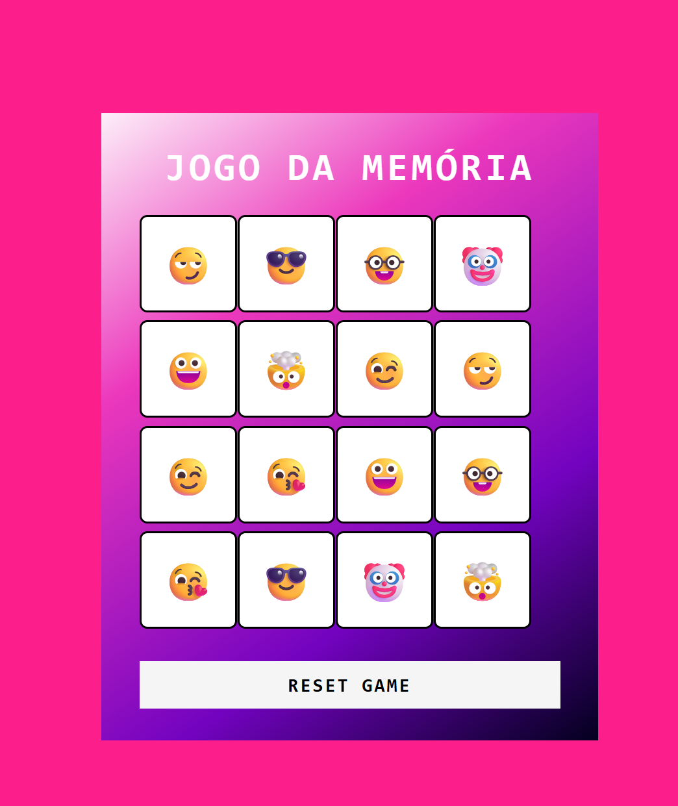
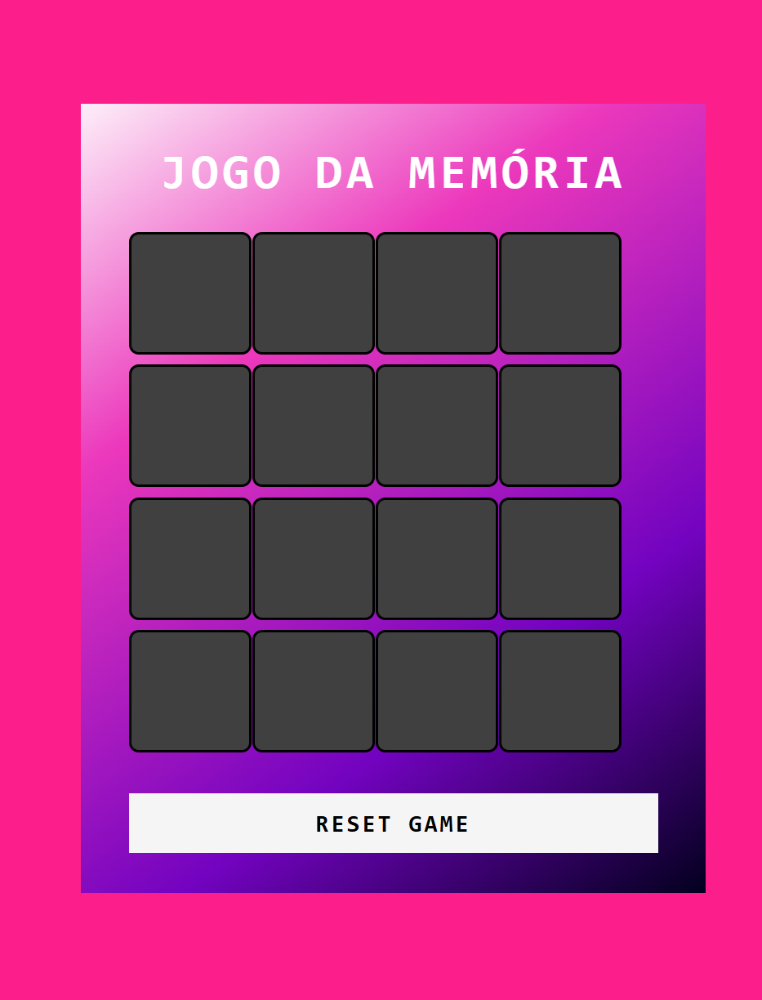
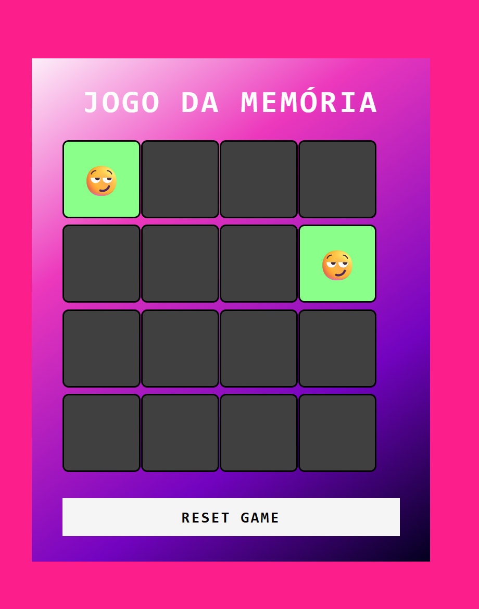
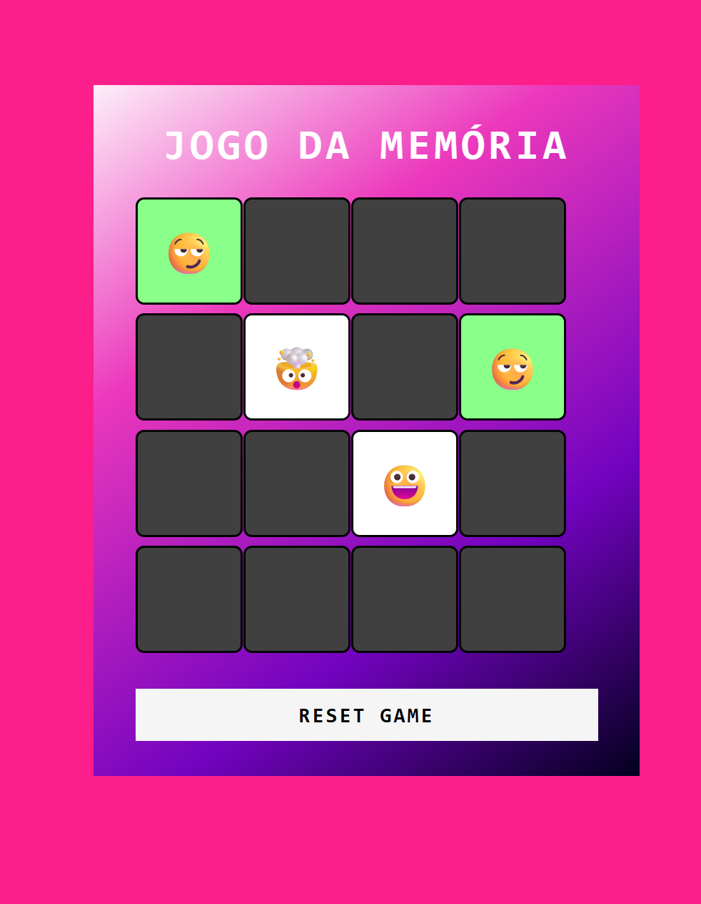

# Jogo Da Memoria com Emojis

Desafio de código do bootcamp otência Tech iFood - Desenvolvimento de Jogos na plataforma Digital Innovation One (DIO).

## Preview

### Inicio da Partida

### Acerto

### Erro

